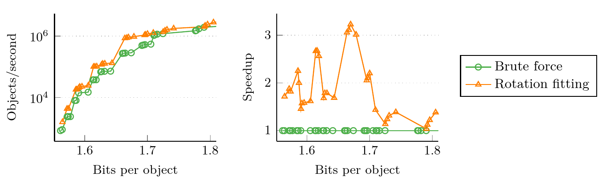

# GpuRecSplit / SimdRecSplit

We greatly improve the construction time of the [RecSplit](https://arxiv.org/abs/1910.06416) Minimal Perfect Hash Function using two orthogonal approaches.
*Rotation fitting* hashes the objects in each leaf to two sets and tries to combine them to a bijection by cyclically shifting one set to fill the holes in the other.
In addition, we harness parallelism on the level of bits, vectors, cores, and GPUs.
The code in this repository achieves significant speedups on SIMD machines and GPUs, compared
to the original [RecSplit implementation](https://github.com/vigna/sux/blob/master/sux/function/RecSplit.hpp).


| l | b | Method | Threads | B/Object | us/Object | Speedup |
|---:|---:|:---|---:|---:|---:|---:|
| 16 | 2000 | RecSplit [\[ALENEX'20\]](https://arxiv.org/abs/1910.06416) | 1 | 1.561 | 1152.6 |  |
| 16 | 2000 | SimdRecSplit | 1 | 1.561 | 138.7 | 8 |
| 16 | 2000 | SimdRecSplit | 16 | 1.562 | 28.2 | 40 |
| 16 | 2000 | GpuRecSplit | 4 | 1.562 | 1.3 | 877 |
| 18 | 50 | RecSplit [\[ALENEX'20\]](https://arxiv.org/abs/1910.06416) | 1 | 1.711 | 2919.5 |  |
| 18 | 50 | SimdRecSplit | 1 | 1.706 | 58.2 | 50 |
| 18 | 50 | SimdRecSplit | 16 | 1.707 | 12.3 | 238 |
| 18 | 50 | GpuRecSplit | 4 | 1.708 | 0.8 | 3802 |
| 24 | 2000 | GpuRecSplit | 4 | 1.498 | 525.5 |  |
    
### Library Usage

Clone (with submodules, `git clone --recursive`) this repo and add it to your `CMakeLists.txt`:

```
add_subdirectory(path/to/GpuRecSplit)
target_link_libraries(YourTarget PRIVATE RecSplit SIMDRecSplit GPURecSplit) # or a subset of the targets
```

### Reproducing Experiments

This repository contains the source code and our reproducibility artifacts for the benchmarks specific to GpuRecSplit/SimdRecSplit.
Benchmarks that compare SimdRecSplit to competitors are available in a different repository: https://github.com/ByteHamster/MPHF-Experiments

We provide an easy to use Docker image to quickly reproduce our results.
Alternatively, you can look at the `Dockerfile` to see all libraries, tools, and commands necessary to compile.

#### Cloning the Repository

This repository contains submodules.
To clone the repository including submodules, use the following command.

```
git clone --recursive https://github.com/ByteHamster/GpuRecSplit.git
```

#### Building the Docker Image

Run the following command to build the Docker image.
Building the image takes about 10 minutes, as some packages (including LaTeX for the plots) have to be installed.

```bash
docker build -t gpurecsplit --no-cache .
```

Some compiler warnings (red) are expected when building dependencies and will not prevent building the image or running the experiments.
Please ignore them!

#### Running the Experiments
Due to the long total running time of all experiments in our paper, we provide run scripts for a slightly simplified version of the experiments.
They run fewer iterations and output fewer data points.

You can modify the benchmarks scripts in `scripts/dockerVolume` if you want to change the number of runs or data points.
This does not require the Docker image to recompile.
Different experiments can be started by using the following command:

```bash
docker run --interactive --tty -v "$(pwd)/scripts/dockerVolume:/opt/dockerVolume" gpurecsplit /opt/dockerVolume/<script>.sh
```

`<script>` depends on the experiment you want to run.

| Figure                                                               | Launch command                                | Estimated runtime  |
| :------------------------------------------------------------------- | :-------------------------------------------- | :----------------- |
| Figure 3 <br /> | /opt/dockerVolume/brute-force-vs-rotations.sh | 30 minutes         |

The resulting plots can be found in `scripts/dockerVolume` and have the file extension `.pdf`.
More experiments comparing GpuRecSplit with competitors can be found in a different repository: https://github.com/ByteHamster/MPHF-Experiments

### Licensing
GpuRecSplit is licensed exactly like `libstdc++` (GPLv3 + GCC Runtime Library Exception), which essentially means you can use it everywhere, exactly like `libstdc++`.
You can find details in the [COPYING](/COPYING) and [COPYING.RUNTIME](/COPYING.RUNTIME) files.

If you use the project in an academic context or publication, please cite our paper:

```
@article{gpurecsplit2022,
  author    = {Dominik Bez and
        Florian Kurpicz and
        Hans{-}Peter Lehmann and
        Peter Sanders},
  title     = {High Performance Construction of
        RecSplit Based Minimal Perfect Hash Functions},
  journal   = {CoRR},
  volume    = {abs/2212.09562},
  year      = {2022},
  doi       = {10.48550/arXiv.2212.09562}
}
```
